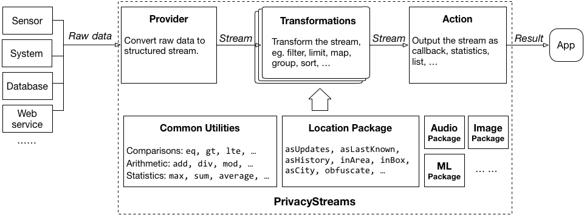
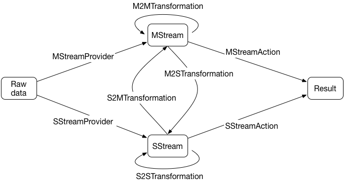
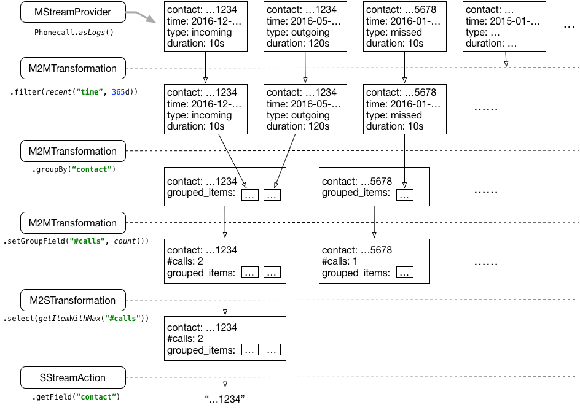

+ [Overview](#overview)
+ [Installing PrivacyStreams](#installing-privacystreams)
+ [Quick examples](#quick-examples)
    - [Getting microphone loudness periodically](#getting-microphone-loudness-periodically)
    - [Getting recent called contacts](#getting-recent-called-contacts)
+ [PrivacyStreams API](#privacystreams-api)
    - [Unified query interface (UQI)](#unified-query-interface-uqi)
    - [Simplifying the code](#simplifying-the-code)
    - [PrivacyStreams pipeline](#privacyStreams-pipeline)
    - [Reusing streams](#reusing-streams)
+ [Exceptions and permissions](#exceptions-and-permissions)
    - [Handling exceptions in blocking pipelines](#handling-exceptions-in-blocking-pipelines)
    - [Handling exceptions in non-blocking pipelines](#handling-exceptions-in-non-blocking-pipelines)
    - [Permission configuration](#permission-configuration)
+ [Debugging and testing](#debugging-and-testing)
    - [Mocking data source](#mocking-data-source)
    - [Printing the streams](#printing-the-streams)
+ [Read more](#read-more)

## Overview

<figure>

</figure>

PrivacyStreams is a framework for **privacy-friendly personal data processing**.
It provides **easy-to-use APIs** in Android to access and process various types of personal data.
It is focused on two related challenges for personal data:
 
- It can be **difficult for developers** to access and process personal data, due to the wide range of APIs and data formats.
- End users don't know what granularity of data is accessed, which can lead to **privacy concerns**.

As an example of both issues,
a sleep monitoring app might only need the microphone to check how loud it currently is. 
The developer would have to write a lot of code to record and process audio using [MediaRecorder](https://developer.android.com/guide/topics/media/mediarecorder.html), 
and end-users might be concerned that the app needs full access to the microphone.

PrivacyStreams is designed to address these issues. Its main features include:

- Providing a unified API and a functional programming approach for all kinds of personal data;
- Making it easy for privacy analysis, thus users can see what granularity of data is accessed and how it is processed;
- Offering many privacy-related functions (`hash`, `blur`, etc.) for developers to integrate privacy-friendly features in their apps.

For example, with PrivacyStreams, a sleep monitor can access and process personal data with few lines of code:
<pre>
<code>// Record a 10-second audio periodically with a 2-minute interval between each two records.
uqi.getData(Audio.recordPeriodic(10*1000, 2*60*1000), Purpose.HEALTH("monitoring sleep"))
   .setField("loudness", calcLoudness(Audio.AUDIO_DATA)) // Set a field "loudness" for each record as the audio loudness
   .onChange("loudness", callback)                       // Callback with loudness value when "loudness" changes</code>
</pre>

Due to the simplicity, apps developed with PrivacyStreams can be easily analyzed and verified to reduce privacy concerns from users.

  &#9989; <i>Microphone is used by this app to calculate loudness periodically.</i>
  
<strong style="color:green;">- Verified by PrivacyStreams.</strong>

## Installing PrivacyStreams

To use PrivacyStreams in your Android app, simply add the following line to `build.gradle` file under the app module.

<pre>
<code>dependencies {</code>
    <code class="highlight">compile 'com.github.privacystreams:privacystreams-core:0.0.4'</code>
    <code>...
}</code>
</pre>

That's it!

### (Optional) Using Google Location API

The Location APIs in PrivacyStreams are based on Google location service.
In order to access location with PrivacyStreams, you will need to install Google Service.

Specifically, add the following line to `build.gradle` file under the app module.

<pre>
<code>dependencies {
    compile 'com.github.privacystreams:privacystreams-core:0.0.4'</code>
    <code class="highlight">compile 'com.google.android.gms:play-services-location:10.2.1'</code>
    <code>...
}</code>
</pre>

Then in your app code, enable Google location service:

<pre>
<code>protected void onCreate(Bundle savedInstanceState) {
        super.onCreate(savedInstanceState);</code>
        <code class="highlight">Globals.LocationConfig.useGoogleService = true;</code>
        <code>...
}</code>
</pre>

### (Optional) Using Accessibility API

Some types of personal data are based on Accessibility APIs, such as browser search events ()`BrowserSearch.asUpdates()`),
WhatsApp & Facebook messages (`Message.asUpdatesInIM()`), etc.
To use these types of data, you need to enable accessibility service by setting `accessibility_enabled` value to `true` in resource XML.

Specifically, in `res/values/bools.xml` (create one if not exist), add the following line(s):

<pre>
<code><resources></code>
    <code class="highlight"><item name="accessibility_enabled" type="bool" format="boolean">false</item></code>
    <code>...
</resources></code>
</pre>

### (Optional) Using Dropbox API

If you are developing a data collector, PrivacyStreams offers a convenient feature:
directly uploading the collected data to your Dropbox (using `DropboxOperators.uploadTo` APIs).

To use Dropbox APIs, you need to install Dropbox library in your app. Specifically:
 
1. Add Dropbox SDK dependency to `build.gradle`.

<pre>
<code>dependencies {
    compile 'com.github.privacystreams:privacystreams-core:0.0.4'</code>
    <code class="highlight">compile 'com.dropbox.core:dropbox-core-sdk:2.1.1'</code>
    <code>...
}</code>
</pre>

2. Set Dropbox global configurations.

<pre>
<code>protected void onCreate(Bundle savedInstanceState) {
        super.onCreate(savedInstanceState);
        Globals.DropboxConfig.accessToken = "<your dropbox access token>";  // Get your token from https://www.dropbox.com/developers
        Globals.DropboxConfig.leastSyncInterval = 30*60*1000;  // Set the interval of uploading (30min in this example).
        Globals.DropboxConfig.onlyOverWifi = false;  // Set whether to upload data only over WIFI. 
        ...
}</code>
</pre>

### Check your installation

To check whether you have successfully installed PrivacyStreams, modify the `onCreate` method in `MainActivity` class as follows:

<pre class="line-numbers">
<code>protected void onCreate(Bundle savedInstanceState) {
    super.onCreate(savedInstanceState);

    UQI uqi = new UQI(MainActivity.this);  // Initialize a UQI (unified query interface) instance.
    uqi.getData(TestItem.asRandomUpdates(10, 10.0, 100), Purpose.TEST("Checking installation."))
                                           // Get random TestItem stream for testing purpose.
       .limit(10)                          // Limit the number of Items to at most 10.
       .debug();                           // Print the items for debugging.
}</code>
</pre>

The above code constructs a UQI instance, accesses a test data stream and prints 10 items.
If your installation was successful, there will be some lines outputted in ADB logcat:

<pre>
D/PrivacyStreams: {y=1, z=5.245425734292725, x=1, id=0, time_created=1489529999937}
D/PrivacyStreams: {y=8, z=5.4303601061807, x=8, id=1, time_created=1489528265617}
D/PrivacyStreams: {y=4, z=0.7657566725249387, x=4, id=2, time_created=1489528265718}
D/PrivacyStreams: {y=5, z=0.49851207499276406, x=5, id=3, time_created=1489528265819}
D/PrivacyStreams: {y=0, z=3.1471844164445564, x=0, id=4, time_created=1489528265920}
D/PrivacyStreams: {y=6, z=6.541989969401724, x=6, id=5, time_created=1489528266021}
D/PrivacyStreams: {y=1, z=5.484224955776141, x=1, id=6, time_created=1489528266122}
D/PrivacyStreams: {y=8, z=0.01880078580959288, x=8, id=7, time_created=1489528266224}
D/PrivacyStreams: {y=3, z=5.170116507338301, x=3, id=8, time_created=1489528266325}
D/PrivacyStreams: {y=2, z=3.3222939911622795, x=2, id=9, time_created=1489528266427}
</pre>

## Quick examples

Before going into details, let's take a quick look at what it is like to use PrivacyStreams for personal data processing.

### Getting microphone loudness periodically

First, let's review the sleep monitor example in [Overview](#overview) section,
in which we want to get audio loudness periodically, in order to detect sleep state.
We used the following code:

<pre>
<code>// Record a 10-second audio periodically with a 2-minute interval between each two records.
uqi.getData(Audio.recordPeriodic(10*1000, 2*60*1000), Purpose.HEALTH("monitoring sleep"))
   .setField("loudness", calcLoudness(Audio.AUDIO_DATA)) // Set a field "loudness" for each record as the audio loudness
   .onChange("loudness", callback)                       // Callback with loudness value when "loudness" changes</code>
</pre>

UQI stands for "unified query interface", and it is the only interface in PrivacyStreams to access all kinds of personal data.

The first parameter of `UQI.getData()` is called a "Provider", which declares the data we want to access.
In the example, `Audio.recordPeriodic()` means we want to access audio data by recording audio periodically;
The second parameter specifies the purpose of the personal data access.
In the example, the purpose is "monitoring sleep", in HEALTH category.

`UQI.getData()` will produce a stream of data items.
In this example, each item represent an audio record. The format of an audio record is shown as follows:

| Reference | Name | Type | Description |
|----|----|----|----|
| `Audio.TIMESTAMP` | `"timestamp"` | `Long` | The timestamp of when current audio record is generated. |
| `Audio.AUDIO_DATA` | `"audio_data"` | `AudioData` | The abstraction of the audio data. |

Below is an example of an Audio item, in which the value of "audio_data" field is an abstraction of the recorded audio:
<pre>
    <code class="language-json">// An example of Audio Item.
    {
        "timestamp": 1489528266640,
        "audio_data": <AudioData@12416728>
    }</code></pre>

Each data type has a list of providers that can produce such type of data.
In this example, the provider is `Audio.recordPeriodic()`, which will provide a live stream of periodically-generated audio record items.

| Type | Reference & Description |
|----|----|
| `MStreamProvider` | `Audio.recordPeriodic(long durationPerRecord, long interval)`   Provide a live stream of Audio items.  The audios are recorded from microphone periodically every certain time interval,  and each Audio item is a certain duration of time long.  For example, <code>recordPeriodic(1000, 4000)</code> will record audio from 0s-1s, 5s-6s, 10s-11s, ...  - `durationPerRecord`: the time duration of each audio record, in milliseconds.  - `interval`: the time interval between each two records, in milliseconds. |

The list of all available data types and corresponding providers can be found [here](items.html).

The second line, `.setField("loudness", calcLoudness(Audio.AUDIO_DATA))`, transform the stream produced by the first line.
Specifically, it set a new customized field "loudness" to each audio record item, indicating the loudness level (dB) of the audio.
<pre>
    <code class="language-json">// An example of Audio Item after setting "loudness" field.
    {
        "timestamp": 1489528266640,
        "audio_data": <AudioData@12416728>,
        "loudness": 30
    }</code></pre>
The loudness value is calculated using a built-in operator `calcLoudness()`. You can find the list of all operators [here](operators.html).

The third line, `.onChange("loudness", callback)`, outputs the transformed stream with a callback.
Specifically, it monitors the value of "loudness", once the value changes, the callback will be invoked.
To get the code work, you will need to define what `callback` is. A working example is shown as follows:

<pre>
<code>// Make sure you have included the following audio permission tag in manifest:
// &lt;uses-permission android:name="android.permission.RECORD_AUDIO" /&gt;

// Define a callback to handle loudness changes
Callback&lt;Integer&gt; callback = new Callback&lt;&gt;() {
    @Override
    protected void onSuccess(Integer loudness) {
        System.out.println("Current loudness is " + loudness + " dB.")
        // ...
    }
}

// Record a 10-second audio periodically with a 2-minute interval between each two records.
uqi.getData(Audio.recordPeriodic(10*1000, 2*60*1000), Purpose.HEALTH("monitoring sleep"))
   .setField("loudness", calcLoudness(Audio.AUDIO_DATA))  // Set a field "loudness" for each record as the audio loudness
   .onChange("loudness", callback)                       // Callback with loudness value when "loudness" changes</code>
</pre>

### Getting recent called contacts

Here is another example: getting a list of recent-called phone numbers.

<pre>
<code>List&lt;String&gt; recentCalledNumbers = 
    uqi.getData(Phonecall.asLogs(), Purpose.SOCIAL("finding your recent called contacts."))
       .filter(Phonecall.TYPE, "outgoing")  // Only keep the outgoing call logs
       .sortBy(Phonecall.TIMESTAMP)         // Sort the call logs according to timestamp, in ascending order
       .reverse()                           // Reverse the order, now the most recent call log comes first
       .limit(10)                           // Keep the most recent 10 logs
       .asList(Phonecall.CONTACT)           // Output the values of CONTACT field (the phone numbers) to a list</code>
</pre>

The above code accesses the call logs with `Phonecall.asLogs()` and processes the call logs with functions like `filter`, `sortBy`, etc.

The format of `Phonecall` item is shown as follows:

| Reference | Name | Type | Description |
|----|----|----|----|
| `Phonecall.TIMESTAMP` | `"timestamp"` | `Long` | The timestamp of when the phonecall is happened. |
| `Phonecall.CONTACT` | `"contact"` | `String` | The contact (phone number or name) of the phonecall. |
| `Phonecall.DURATION` | `"duration"` | `Long` | The duration of the phonecall, in milliseconds. |
| `Phonecall.TYPE` | `"type"` | `String` | The phonecall type, could be "incoming", "outgoing" or "missed". |

Note that "Reference" is the equivalence to "Name", i.e. `filter(Phonecall.TYPE, "outgoing")` is the same as `filter("type", "outgoing")`.

**About permissions.** Accessing call logs requires *READ_CALL_LOG* permission in Android.
To use the above code, you need to add the permission tag in `AndroidManifest.xml` and handle the exception if the permission is denied by user. For example:

In `AndroidManifest.xml`:
<pre><code>...</code>
<code class="highlight">&lt;uses-permission android:name="android.permission.READ_CALL_LOG" /&gt;</code>

<code><application
           android:theme="@style/AppTheme"
           ...</code></pre>

In Java code:

<pre>
<code>try {
    List&lt;String&gt; recentCalledNumbers = 
        uqi.getData(Phonecall.asLogs(), Purpose.SOCIAL("finding your closest friends."))
           .filter(Phonecall.TYPE, "outgoing")  // Only keep the outgoing call logs
           .sortBy(Phonecall.TIMESTAMP)         // Sort the call logs according to timestamp, in ascending order
           .reverse()                           // Reverse the order, now the most recent call log comes first
           .limit(10)                           // Keep the most recent 10 logs
           .asList(Phonecall.CONTACT)           // Output the values of CONTACT field (the phone numbers) to a list
} catch (PrivacyStreamsException e) {
    if (e.isPermissionDenied()) {
        String[] deniedPermissions = e.getDeniedPermissions();
        ...
    }
}</code></pre>

That's it! More details about exception handling will be discussed in [Permissions and exception handling](#permissions-and-exception-handling) section.

## PrivacyStreams API

This section will explain the details about PrivacyStreams APIs with a more complicated example.

Suppose we want to do the following programming task with PrivacyStreams:

- Get the phone number that has the most phonecalls with the user in the past year.

The code to do the task with PrivacyStreams is as follows:

<pre>
<code class="line-numbers">String mostCalledContact = 
     uqi.getData(Phonecall.asLogs(), Purpose.SOCIAL("finding your closest contact."))                      // Get a stream of call logs
        .transform(Filters.keep(TimeOperators.recent(Phonecall.TIMESTAMP, Duration.days(365))))            // keep the call logs in recent 365 days
        .transform(Groupers.groupBy(Phonecall.CONTACT))                                                    // group by contact (phone number)
        .transform(Mappers.mapEachItem(ItemOperators.setGroupField("#calls", StatisticOperators.count()))) // set "#calls" to the number of logs in each group
        .transform(Selectors.select(ItemsOperators.getItemWithMax("#calls")))                              // select the item with largest "#calls"
        .output(ItemOperators.&lt;String&gt;getField(Phonecall.CONTACT));                                        // get the contact field of the item
</code></pre>

Looks messy? Don't worry, next I will show you what happened and how to simplify it.

### Unified query interface (UQI)

In PrivacyStreams, all types of personal data can be accessed and processed through the unified query interface (**UQI**).

<pre>
<code style="font-size:1.4rem;" class="highlight">UQI.getData(Provider, Purpose)[.transform(Transformation)]*.output(Action)</code>
</pre>

The query describes a **PrivacyStreams pipeline**, which is a sequence of three types of functions, including:

- **1** data providing function (i.e. **Provider**) that gets raw data from data sources and converts it to a stream in standard format.
    - For example, `Phonecall.asLogs()` convert raw call logs in Android database to a stream of Phonecall items;
- **N (N=0,1,2,...)** transforming functions (i.e. **Transformation**s), each of them takes a stream as input and produce another stream as output.
    - For example, `filter(Phonecall.TYPE, "outgoing")` filters the stream and only keeps the items whose `TYPE` is `"outgoing"`;
- **1** data outputting function (i.e. **Action**), which outputs the stream as the result needed by the app.
    - For example, `asList(Phonecall.CONTACT)` collect the `CONTACT` field of items to a list.

The **Transformation** and **Action** functions are based on a lot of operators, including comparators, arithmetic operators, etc..
For example, `Filters.keep()` is a **Transformation**, and it accepts operator `TimeOperators.recent()` as a parameter, meaning it only keeps the items whose TIMESTAMP field is a recent time.

- **The full list of available data types and corresponding providers is at [here](items.html);**
- **The full list of available providers, transformations, actions and operators is at [here](operators.html).**

Except for the functions, a query also requires a `Purpose` parameter to state the purpose of the data access.
In the example, the purpose of accessing call logs is "finding your closest contact", in SOCIAL category.
**We suggest you carefully explain the purposes in your app,**
because explaining the purposes can help users understand why your app needs the data, hence improving the privacy friendliness of your app.
We have several purpose categories (such as `Purpose.ADS(..)`, `Purpose.SOCIAL(..)`, etc.) for you to select from.

### Simplifying the code

In practice, the nested functions may be redundant, thus we wrap some common function combinations to one function for simplicity. 
For example:

- `.transform(Filters.keep(xxx))` can be simplified as `.filter(xxx)`;
- `.transform(Groupers.groupBy(xxx)` can be simplified as `.groupBy(xxx)`;
- `.transform(Mappers.mapEachItem(ItemOperators.setGroupField(xxx)))` can be simplified as `.setGroupField(xxx)`;
- ...

With the simplification, the code in the above example can be written as:
<pre>
<code class="line-numbers">String mostCalledContact = 
     uqi.getData(Phonecall.asLogs(), Purpose.SOCIAL("finding your closest contact."))
        .filter(TimeOperators.recent(Phonecall.TIMESTAMP, Duration.days(365)))
        .groupBy(Phonecall.CONTACT)
        .setGroupField("#calls", StatisticOperators.count())
        .select(ItemsOperators.getItemWithMax("#calls"))
        .getField(Phonecall.CONTACT);</code></pre>

If you use static import, the code can be even briefer.
For example, with `import static com.github.privacystreams.commons.time.TimeOperators.recent;`, you can simplify `TimeOperators.recent(xxx)` with `recent(xxx)`.
With static import, the above code can be simplified as:
<pre>
<code class="line-numbers">String mostCalledContact = 
     uqi.getData(Phonecall.asLogs(), Purpose.SOCIAL("finding your closest contact."))
        .filter(recent(Phonecall.TIMESTAMP, Duration.days(365)))
        .groupBy(Phonecall.CONTACT)
        .setGroupField("#calls", count())
        .select(getItemWithMax("#calls"))
        .getField(Phonecall.CONTACT);</code></pre>

### PrivacyStreams pipeline

The figure below shows the overview of a **PrivacyStreams pipeline**:

<figure>

</figure>

The basic data types in PrivacyStreams are **Item** and **Stream**.

- **Item** is an element in a Stream. All **Item**s are in a map format, in which each key-value pair represents the name and value of a field.
    - Each kind of personal data has a list of pre-defined fields. Below is an example of call log **Item**:

    <pre>
    <code class="language-json">// An example of call log Item.
    {
        "timestamp": 1489528267720,
        "contact": "14120001234",
        "type": "outgoing",
        "duration": 30000
    }</code></pre>
- **Stream** is what being produced, transformed and outputted in a PrivacyStreams pipeline, and a **Stream** is a sequence of **Item**s. In PrivacyStreams, we have two kinds of Streams:
    1. **MStream** (short for multi-item stream) contains multiple items.
        - For example, the “call log stream” (`Phonecall.asLogs()`) contains many phonecall items, and the stream of location updates contains many location items;
    2. **SStream** (short for single-item stream) contains only one item.
        - For example, the “last-known location stream” (`GeoLocation.asLastKnown()`) only contains one location item.
    
    The fine-grained data processing state machine is as follows:

<figure>

</figure>

The pipeline of the running example is illustrated as follows (note that some field names are simplified and the field values are mocked):

<figure>

</figure>

### Reusing streams

Sometimes you may need to reuse a stream for different actions.
For example, in the above example, if we also want to get the phone number that has the longest total phonecall duration, we may need to reuse the call log stream.

We provide a method `fork(int)` to support stream reusing, where the `int` parameter means the number of reusable times.

<pre>
<code class="line-numbers">MStreamInterface streamToReuse = 
              uqi.getData(Phonecall.asLogs(), Purpose.SOCIAL("finding your closest contact."))
                 .filter(recent(Phonecall.TIMESTAMP, Duration.days(365)))
                 .groupBy(Phonecall.CONTACT)
                 .fork(2);  // fork current stream to reuse twice.
        
String mostCalledContact = 
    streamToReuse.setGroupField("#calls", count())
                 .select(getItemWithMax("#calls"))
                 .getField(Phonecall.CONTACT);
                 
String longestCalledContact = 
    streamToReuse.setGroupField("durationOfCalls", sum(Phonecall.DURATION))
                 .select(getItemWithMax("durationOfCalls"))
                 .getField(Phonecall.CONTACT);</code></pre>

### Non-blocking pipeline

So far I have shown how to build a blocking pipeline (the pipeline will block the execution until the result returns).

In Android, non-blocking pipelines might be more common. A non-blocking pipeline will **NOT** pause the code execution, and its result will be returned asynchronously.

PrivacyStreams provides many **callback Action**s (in `Callbacks` class) and **callback-based collector Action**s (in `Collectors` class) for building non-blocking pipeline.

- For example, following code will not block, and each item will be printed asynchronously.
    - `.debug()` is the equivalence of `.output(Callbacks.forEach(ItemOperators.debug()))`.
    
    <pre>
    <code> uqi.getData(MockItem.asRandomUpdates(10, 10.0, 100), Purpose.TEST("Testing mock data query."))
        .debug();</code></pre>
       
- The "most-called contact" example can also be implemented as non-blocking.
    - `.output(getField(), callback)` is the equivalence of `.output(Collectors.collectItem(getField(), callback))`
    
    <pre>
    <code> uqi.getData(Phonecall.asLogs(), Purpose.SOCIAL("finding your closest contact."))
        .filter(recent(Phonecall.TIMESTAMP, Duration.days(365)))
        .groupBy(Phonecall.CONTACT)
        .setGroupField("#calls", count())
        .select(getItemWithMax("#calls"))
        .output(ItemOperators.&lt;String&gt;getField(Phonecall.CONTACT), new Callback&lt;String&gt;() {
            @Override
            protected void onSuccess(String contact) {
                System.out.println("Most-called contact: " + contact);
            }
        });</code></pre>
        
That's it. When you are developing you app, select either blocking or non-blocking pipeline to fulfill your need.

## Exceptions and Permissions

Sometimes the pipeline may be failed due to exceptions, such as InterruptedException, PermissionDeniedException, etc.

In PrivacyStreams, exception handling is extremely easy for both blocking pipeline and non-blocking pipeline.

### Handling exceptions in blocking pipelines

For blocking pipelines, simply put your query in a try block and catch `PrivacyStreamsException`. For example:

<pre>
    <code>try {
        result = uqi.getData(...).transform(...).output(...);
    } catch (PrivacyStreamsException e) {
        System.out.println(e.getMessage());
    }</code></pre>

### Handling exceptions in non-blocking pipelines

For non-blocking pipelines, simply override the `onFail(PrivacyStreamsException e)` method in your result handler. For example:

<pre>
    <code> uqi.getData(...)
        .transform(...)
        .output(..., new Callback&lt;Object&gt;() {
            @Override
            protected void onSuccess(Object result) {
                ...
            }
            
            @Override
            protected void onFail(PrivacyStreamsException e) {
                System.out.println(e.getMessage());
            }
        });</code></pre>

### Permission configuration

In Android, personal data is controlled with a permission-based access control mechanism. Android apps need to declare permissions in `AndroidManifest.xml`.
For Android 6.0+, apps must request permissions at runtime, including checking whether permissions are granted, prompting users to grant the permissions and handling users' access control decisions.
With Android standard APIs, these are often headache.

In PrivacyStreams, configuring permissions can be much easier. Follow the steps below:

1. Write your pipeline, and cache the exception;
2. Print the exception, and you will see which permissions are needed;
3. Add the needed permissions to `AndroidManifest.xml`.

That's it. PrivacyStream will automatically generate a dialog to ask users to grant permissions. If not granted, there will be a `PrivacyStreamsException`.

## Debugging and testing

PrivacyStreams provides some simple interfaces to support debugging and testing.

### Mocking data source

You can mock a data source using `MockItem` class for debugging and testing. For example:

- Mocking a stream with random items.
    - `MockItem.asRandomUpdates()` can provide a live MStream that produces random items periodically;
    - `MockItem.asRandomList()` can provide a MStream that produces a list of random items in a batch;
    - `MockItem.asRandomInstance()` can provide an SStream that contains a random item.
- Mocking a stream from a file.
    - `uqi.getData(...).transform(...).archiveTo("/sdcard/data.json")` will record the stream to a file;
    - `uqi.getData(MockItem.fromArchive("/sdcard/data.json"), ...)` will load and replay the stream from the file.

### Printing the streams

Most data types support serialization, i.e. you can easily print the streams and see what happens.

- For example, if you have a N-step pipeline `uqi.getData(...).step1(...).step2(...)....stepN(...))`, you can print any step you want to see what is going on.
    - `uqi.getData(...).debug()`;
    - `uqi.getData(...).step1(...).debug()`;
    - `uqi.getData(...).step1(...).step2(...).debug()`;
    - ...
    
## Read more

### API Docs

For more information about PrivacyStreams APIs, please refer to:

- [PrivacyStreams Javadoc](javadoc/index.html);
- [Available data types](items.html);
- [Available operators](operators.html).

### News & Posts

- [{{ post.title }}]({{ site.baseurl }}{{ post.url }}) {{ post.date | date_to_string }}

